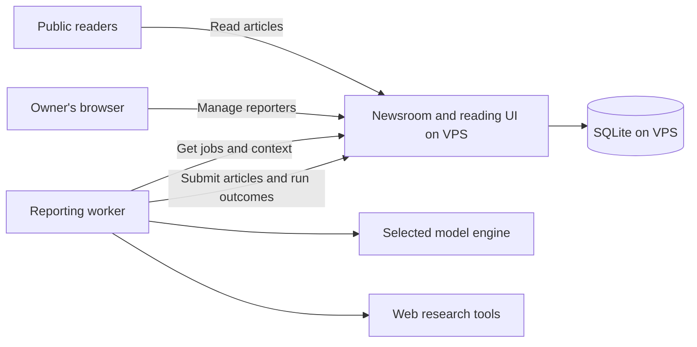

# Reporting worker and newsroom API

The newsroom stores and coordinates reporting; a separate worker performs
the research and AI work. This document defines that boundary within the
[selected application stack](implementation-design.md#accepted-core-stack).
Accepted requirements and proposed implementation details are separate.
The implemented [server contract](server-contract.md) translates this behavior
into concrete records and HTTP operations without selecting a model engine.

## Accepted responsibility split

Accepted on September 24, 2026: the newsroom is a data and coordination
service. It stores reporter instructions, what reporters should do and when,
job state, and generated articles. It does not perform the AI work. The worker
queries the newsroom API for jobs, performs the research, and submits articles
or other run outcomes through that API.

The owner wants the newsroom to stay independent of where and how AI work
runs. The tradeoff is a network boundary with authentication, durable state,
and recovery from interrupted communication.

| Newsroom on the VPS | Reporting worker |
| --- | --- |
| Store and edit reporter instructions and schedules. | Retrieve an assigned run and its instructions. |
| Keep run state and make due work available. | Research the assignment using the selected tools and model. |
| Provide access to retained articles and search results. | Use past reporting as context and prepare any AI-generated summaries. |
| Validate submitted records, store articles, and serve the reading UI. | Submit articles, a successful empty result, a pause acknowledgment, or a failure. |
| Detect overdue or failed work and manage notification state. | Report progress or renew ownership while working. |

Ordinary database queries, full-text search, validation, scheduling, and page
rendering are server responsibilities. The design must not quietly add model
calls for summaries, embeddings, editorial checks, or other AI work to the
newsroom service. Any AI-generated context belongs to the worker side.
The accepted [coverage rule](product-design.md#reporting-memory-and-coverage-window)
also excludes deterministic server calculations of research spans. The worker
supplies article coverage metadata; the server stores and queries it.

## Worker location

Accepted on September 26, 2026: run the worker on the owner's current Mac.
This selects one of the local hosts considered in the September 25
[implementation sequence](implementation-design.md#implementation-sequence)
and supersedes the earlier undecided host choice. The owner requested this
machine; no further reason was stated. The website and authoritative SQLite
database remain on the VPS, and the newsroom service performs no AI work.

The tradeoff is dependence on the Mac's availability. The API boundary allows
later relocation without moving the newsroom or its database. The
[operations guide](worker-operations.md) records the worker implementation.

## Worker connection

Accepted on September 24, 2026: use an authenticated API between the worker
and newsroom. The owner chose the API as the cleaner interface after noting
that SSH commands could also query SQLite on the VPS.

The engineering design is a small HTTPS API inside Flask. The worker initiates
connections to get work, retrieve context, and submit results. SQLite stays
local to the VPS. There is no separate API service or second worker transport
in v1. The tradeoff is maintaining endpoint authentication and a stable request
contract. SSH remains a valid operational tool, not the normal worker interface.

Use a credential limited to reporting operations. The owner retains article
deletion and newsroom configuration permissions. Keep model credentials,
when needed, with the process that uses them. The
[public reading site](product-design.md#audience-and-ownership) does not remove
authentication from the worker API. The selected
[access design](implementation-design.md#access-boundary) uses Cloudflare Access
with a dedicated service token for the worker and separate owner browser access.

### Daily work discovery

Accepted on September 26, 2026: start the worker daily at 06:00 Pacific Time
on the current Mac. This supersedes the earlier 01:00 choice. The owner wants
to schedule reporters for the following day and inspect the results after
waking. This is a startup time, with no strict coverage cutoff or completion
deadline. The Mac must be awake for cron to run.

Clarified by the owner on September 25, 2026: the worker checks for new work
once a day, at a time chosen on the worker side. The server does not need to
know that time. This supports the accepted day-based schedules and is the
reason the newsroom has [no manual-run action](product-design.md#newsroom-controls).
The tradeoff is that new assignments or settings saved after the daily check
may wait until the next check to be picked up. Under the accepted
[schedule activation rule](product-design.md#schedules-by-day), new schedules
and schedule changes start tomorrow in Pacific Time and preserve today's
existing assignments.

Engineering implication: do not require continuous polling, a server push
connection, or a worker wake-up mechanism. A daily check can retrieve work for
multiple reporters. The daily discovery cadence does not limit API requests
needed to process that work, such as fetching context, renewing a claim,
submitting results, or retrying interrupted communication. The
[server contract](server-contract.md#daily-discovery-and-claims) defines claim
and retry behavior. Extra runs, if needed, are initiated on
the worker's machine rather than requested through the newsroom.

## Model engine

Accepted on September 26, 2026: use vanilla Codex CLI with GPT-6 Luna and
the existing ChatGPT subscription for v1. Use built-in research tools, with
no plugins or separate web-search provider. The later
[article history search](article-history-search.md) adds a private read-only
QMD MCP connection for prior News coverage. This supersedes the
Qwen/Ollama and Pi/Exa selections. The owner wants less integration code and
to benefit from OpenAI's improvements. The tradeoff is cloud processing and
shared subscription limits.

Accepted on September 29, 2026: use GPT-6.1 Sol (`gpt-6.1-sol`) with high
reasoning for reporting. This supersedes the GPT-6 Luna model choice and
the earlier preference for a moving Luna alias. The owner requested the
new model and high reasoning; no further reason was specified. The
[official model reference](https://developers.openai.com/api/docs/models/gpt-6.1-sol),
checked on September 29, confirms high reasoning, structured output, web search,
and MCP support. The existing ChatGPT subscription and Codex tools remain in use.
The earlier Luna pilot does not establish Sol's reporting quality or runtime.
Use the explicit configurable model name; do not promise automatic upgrades
across generations. Codex tool improvements arrive with ordinary CLI updates.

Accepted on September 26, 2026: process up to eight reporters concurrently.
The owner chose eight because inference runs in the cloud. Claim only when
capacity is available. Each attempt keeps its own context and durable state.
The tradeoff is greater concurrent use of the shared subscription allowance.

See [worker operations](worker-operations.md) for implementation and deployment.

## Timeliness and completion

Accepted on September 24, 2026: the VPS detects overdue reporting by comparing
scheduled work with outcomes received after a reasonable execution delay.
The reading website must indicate missing or late news when scheduled work
has not completed. This detection must work even if the worker sends nothing,
so the server can identify a reporting-pipeline problem independently.

Apply this to completed runs, not the existence of an article: the accepted
[empty-result behavior](product-design.md#runs-with-nothing-to-publish) means
a successful run can add no article. The original three worker outcomes were
articles, nothing to publish, or failure. On September 25, 2026, the owner
added an explicit [pause acknowledgment](#pause-acknowledgments-and-worker-contact).
No received outcome after the expected reporting day has ended is a separate
detectable condition.

The reason is to distinguish a quiet news day from missing reporting without
requiring the owner to inspect the worker. The tradeoff is a grace period
and monitoring state that must avoid raising alarms during normal execution.
A missing result does not establish the cause of the pipeline problem.

The server must be able to distinguish:

- Scheduled work that no worker has claimed.
- A claimed run that is still in progress.
- A run completed with one or more articles.
- A run completed successfully with nothing to publish.
- Work explicitly skipped because the reporter is paused, without research.
- A run that failed, including whether another attempt is pending.

Late is a timeliness condition, not a substitute for those outcomes. An
in-progress run may be late and later complete successfully. A failed run or
pause acknowledgment is not a successful research result. These are
deterministic outcome checks, not an inference about dates covered.

### Pause acknowledgments and worker contact

Accepted on September 25, 2026: when the worker skips reporting because a
reporter is paused, it submits an explicit acknowledgment such as "Nothing to
submit because the reporter is paused." The server records that the worker
contacted it and respected the pause. If no expected signal arrives, the
server must still identify and alert the owner to the missing communication.

The owner's reason is to notice worker failures even when reporting is paused.
The tradeoff is that pausing stops research but does not remove the need for
worker communication. This replaces the earlier assumption that paused
reporters can simply disappear from missing-result monitoring.

Represent this as a distinct skipped outcome, such as `skipped_paused`, rather
than successful "nothing to publish." It creates no article and does not
claim successful research or a coverage span. A finished report is still
submitted under the accepted [pause behavior](product-design.md#pausing-reporters);
do not replace finished work with a skip acknowledgment.

Under the accepted resume rule on that same page, acknowledged recurring
occurrences stay skipped. An unfinished contractor can resume its original
assignment after a pause acknowledgment, using a new attempt. History must
distinguish that acknowledgment from its eventual research result.

An acknowledgment proves contact at that time. It does not establish that
other assignments completed, that the model is healthy, or that the worker
remains online. Keep worker contact and individual reporting outcomes separate
so a worker can check in and still have overdue reports.

### Daily worker check-in design

The owner reiterated on September 25, 2026 that the worker fetches which
reports are needed every day. Engineering design derived from that requirement:
record the authenticated daily work request as the worker's check-in, even
when the returned assignment list is empty. The worker discovers whether any
reporting is due by making that request, so an empty day still produces a
signal. This needs no separate background heartbeat process.

Return paused reporters whose reporting day is due so the worker can submit
their skipped outcomes. Exact API operations and activation of monitoring
during deployment remain to be specified.

If a whole Pacific calendar day passes without a check-in, show a worker
communication warning and send one email for the incident. This detects a
missing worker even with an empty roster or only weekly or monthly reporters.
Individual expected results, including pause acknowledgments, still need
their own day-based checks. A check-in alone must not hide an unfinished run.

### Overdue window for day-based schedules

Accepted on September 25, 2026: allow the entire expected reporting day in
Pacific Time before marking a missing result overdue. This replaces the
one-hour grace period accepted earlier that day, which depended on a known
execution time. The accepted
[day-based schedules](product-design.md#schedules-by-day) give the worker
control of execution timing. The server still detects missing results even
when a worker never contacts it.

A Thursday assignment can finish at any time on Thursday and becomes overdue
when Friday begins if no result has arrived. There is no additional hour of
grace after the day ends. Use calendar-day boundaries rather than a fixed
24-hour duration so the rule follows local dates across daylight-saving changes.
Making an assignment available on its reporting day does not require the
worker to start at midnight.

A successful empty result counts as completion. A later successful result
is still accepted and clears the overdue warning; the monitoring deadline
does not cancel the run. An explicit failure remains visible under the
failure policy rather than being treated as silence. A pause acknowledgment
satisfies the expected response for skipped work without claiming research
was completed.

The owner accepted this replacement after removing clock times from server
schedules. It gives the worker a full reporting day without requiring it to
share its planned start time. The tradeoff is that missing work is detected
the following day. A worker that starts close to midnight can be marked
overdue while still working, and later success clears that warning.

### Proposed monitoring implementation

Engineering recommendation; not yet accepted: use a small periodic server-side
maintenance command to make due work available and inspect overdue runs.
Monitoring must not depend on a worker being online or the owner opening the
site.

Missed one-time work follows the accepted
[contractor policy](product-design.md#recurring-reporters-and-one-time-contractors):
retain assignments without automatic expiration and combine unfinished due
dates into one catch-up when the worker returns. Include today when scheduled;
leave future dates pending. The worker determines usefulness from the prompt
and original dates; the server does not infer that they are stale. See the
[contractor date rules](contractor-schedules.md).

### Alert grouping

Accepted on September 25, 2026: send one email for a continuous worker outage,
without repeated daily reminders. Keep every affected reporter and missing
run visible in the newsroom, but do not send separate missing-run emails for
the same outage. When the worker is communicating and an individual run fails,
send that run's own alert after its bounded retries are exhausted.

The owner accepted the recommendation; no further reason was stated. This
avoids an inbox full of reporter alerts for one missing worker. The tradeoff
is that an unresolved outage remains visible on the site without generating
daily email reminders. Grouping does not establish the cause of the outage
and must not mark individual reports as complete.

Implement this with one logical outage incident across affected reporting
days and ordinary per-run failure incidents when communication is healthy.
Notification-delivery retries are attempts to deliver the original alert,
not permission to create new daily reminders. Exact incident resolution,
handling of reports still outstanding after contact resumes, recovery notices,
and email-delivery retry mechanics remain implementation details to specify.
Use the selected [Resend delivery](implementation-design.md#email-delivery)
from the VPS. Sending credentials belong to the server, not the research worker.

## Missed recurring runs and catch-up

Accepted on September 25, 2026: when the worker returns after missed recurring
assignments, make one fresh catch-up run per affected reporter available.
Keep missed occurrences visible in history rather than executing a separate
report for each one. Do not mark those missed occurrences as successful runs.

The owner accepted this recovery behavior with an explicit requirement to
preserve the intent of the [coverage prompt](product-design.md#reporting-memory-and-coverage-window).
For an instruction such as "since your last report," the worker must account
for the full gap rather than assuming a normal schedule interval. An
upcoming-weekend prompt calls for a different span. The worker's AI determines
and reports that span; the server does not compute it for the catch-up run.

This avoids stale backlogs while retaining developments from the outage.
The tradeoff is that a single catch-up run may have substantially more work
than usual. This catch-up replacement policy applies to recurring reporters.
An overdue one-time contractor retains its original assignment under the
[contractor policy](product-design.md#recurring-reporters-and-one-time-contractors).

### Worker-supplied coverage and retained history

The worker reads the prompt, chooses the coverage span, and submits that span
on each article. The server stores it alongside title, summary, and body.
Archive retrieval can return and filter that metadata without interpreting
the prompt or judging research completeness.

Article publication dates, run timestamps, and explicit outcomes remain
ordinary operational facts. The worker can retrieve these records as needed;
the server does not assemble an authoritative research window from them.
For a new reporter, past history is empty and the AI follows the prompt.

The earlier proposals for a server-maintained last-covered timestamp and
fixed lower/upper research boundaries are withdrawn. Neither cadence, a
successful empty result, nor the time an attempt started authorizes the server
to infer coverage. Coverage metadata on successful empty outcomes, if wanted,
would also have to be supplied by the worker; it is not part of the current
article-only proposal.

## Proposed validation of submissions after deletion

The accepted [reporter removal rule](product-design.md#reporter-removal-and-stable-identity)
permits incoming work already underway, but requires rejection and an alert for
ongoing new reporting after deletion. The following validation approach is an
engineering recommendation for enforcing that accepted behavior:

- Bind each submission to a server-issued run ID and its original reporter.
  Record when execution was claimed and when the reporter was deleted.
- Claim work when starting it. Merely listing available assignments during
  the daily check does not establish that all of them are already underway.
- Permit an otherwise valid final result from a run claimed before deletion.
  Do not issue new runs or allow new claims for a deleted reporter.
- Commit one completed result per run, containing any articles it produced.
  An identical retry returns the existing receipt without creating more
  articles or raising a false post-deletion alert.
- Reject an attempt to submit new work for a deleted reporter, or to replace
  a finished run with a different report. Record enough run and
  worker information to explain the incident and alert the owner. Repeated
  requests for the same incident must not create an email flood.

Do not discard a valid pre-deletion run solely because it was delivered late,
and do not rely on a loose one-day permission window as a substitute for
checking the assigned run. Exact expiration and response contracts remain to
be specified.

## Starting work and recovering after a crash

Accepted on September 25, 2026: before beginning research, the worker tells
the server it is starting the assigned run. The server records an attempt
and its start time. Fetching a list of assignments is not this start signal.
Research and article preparation then happen locally, followed by submission
of the completed result. A crash before submission leaves an attempt record
on the server, not an article or a saved model conversation.

The owner accepted this after discussing the benefit: distinguish work never
picked up from work that started but did not finish, and establish whether
work began before its reporter was deleted. The tradeoff is one additional
API request before each research attempt. This start signal does not replace
the separate daily work-discovery check-in.

Also accepted on September 25, 2026: restarting unfinished research from
scratch after a crash is acceptable for v1, within the bounded retry limit.
Preserve the earlier attempt in server history and create a new attempt under
the same run. Saving and resuming an unfinished model conversation is not
required. This simplifies recovery at the cost of sometimes repeating research.

The worker saves completed results locally until the server acknowledges them.
After restart, it retries delivery of saved results before starting replacement
research. If submission succeeded but its acknowledgment was lost, the server
returns the original receipt without publishing again. A replaced attempt
cannot publish a new result; this guards against a stalled old process later
resuming. An identical retry of an already accepted result remains safe.

These are accepted behavior rules. Exact claim-token mechanics, renewal and
replacement timing, and retry delays remain implementation details to specify.
They must preserve saved-result delivery and must not treat the reporting-day
deadline alone as cancellation of work already underway.

## Proposed protocol requirements

These engineering recommendations implement the agreed worker boundary and
the accepted start and recovery behavior above. Exact endpoints, fields, and
timings remain to be specified where noted.

- Claim a run atomically and issue an expiring claim token. Only the current
  claimant may complete it. A worker can renew the claim while it works.
- Give each scheduled occurrence a stable run ID, so polling or retrying a
  request cannot create duplicate scheduled work.
- Record the prompt used for the run. Subsequent prompt edits must not change
  the instructions recorded for a completed article.
- Expose the reporter's pause flag so the worker can respect it before starting
  further work. Under the accepted [pause behavior](product-design.md#pausing-reporters),
  pausing alone does not revoke a running assignment or reject its otherwise
  valid result. Include an explicit skipped outcome when pause prevents work;
  do not require continuous polling for pause changes.
- Under the accepted [reporter removal behavior](product-design.md#reporter-removal-and-stable-identity),
  deletion also preserves valid submissions from work already underway. Stop
  future assignments and keep the reporter out of the active roster while
  retaining its identity for the incoming articles. Deletion alone must not
  invalidate work already underway or its current claim. Detect and alert on
  new post-deletion reporting under the proposed validation above.
- Retrieve history through the application and exclude deleted articles from
  future reporting context. Retain original reporter IDs on articles.
- Submit a completed result as one operation. Validate and store its articles
  and completion state together. A successful empty result contains no articles
  and an explicit outcome that the newsroom can display.
- Make repeat submissions safe. A lost response must not cause duplicate
  articles, and a stale claim must not overwrite a newer attempt's result.
- Report errors explicitly and use the accepted bounded retry and email policy.
  The server must also recover claims abandoned by a disconnected worker.
- Follow the accepted [contractor recovery rule](product-design.md#recurring-reporters-and-one-time-contractors).
  An exhausted assignment remains failed until changed instructions authorize
  a new retry allowance or a later scheduled run succeeds. Later success also
  satisfies earlier failed dates while retaining their history. The worker
  discovers available work through its normal check and must not restart
  exhausted research on its own each day.

The [server contract](server-contract.md#worker-api) now defines result payloads,
claims, retries, and retired-record behavior. The [worker runbook](worker-operations.md)
covers their implementation and the remaining deployment steps.
